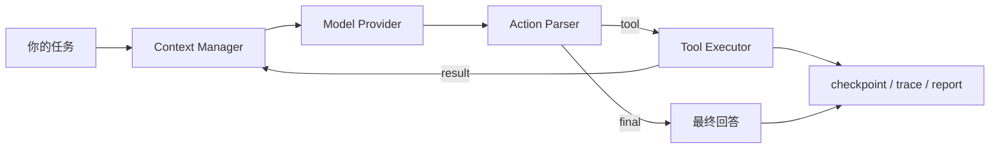

<div align="center">

# 🐾 Runi

**一只安静、可靠、愿意把每一步都记清楚的本地 Coding Agent。**

让大模型在受控的 C++ 运行时里读代码、搜代码、执行命令、修改文件，并留下可恢复、可审计的运行记录。


[功能](#-它能做什么) · [快速开始](#-快速开始) · [模型配置](#-模型配置) · [编译测试](#-编译与测试) · [项目结构](#-项目结构)

</div>

---

## ✨ 它能做什么

Runi 不是把一次模型调用包装成聊天框，而是给模型套上一条完整、可控的 Agent 执行链：

- **在仓库里行动**：列目录、读文件、全文搜索、执行 shell、完整写入或精确 patch 文件。
- **多 Provider 接入**：支持 Ollama、OpenAI Responses-compatible、Anthropic Messages-compatible 与 DeepSeek Anthropic-compatible API。
- **受控修改**：路径始终限制在工作区内；高风险工具经过 `ask`、`auto` 或 `never` 审批策略。
- **可恢复上下文**：保存 session、工作记忆、持久记忆、checkpoint，并检测关键文件是否已经变化。
- **可审计运行**：每次请求生成独立的 `task_state.json`、`trace.jsonl` 与 `report.json`。
- **上下文预算**：按稳定前缀、记忆、相关记忆、历史记录和当前请求组装 prompt，超限时按规则压缩。
- **确定性评测**：内置 12 个脚本化任务，覆盖正常编辑、参数错误、路径越界、重复调用、恢复与记忆契约。



## 🚀 快速开始

### 1. 准备环境

- Windows 10/11
- 支持 C++20 的编译器：MSVC、GCC/MinGW-w64 或 Clang
- CMake 3.24+
- Ninja（使用仓库预设时需要）

> 当前内置 HTTP 客户端基于 WinHTTP，因此联网 Provider 的完整运行路径暂时只支持 Windows。核心库可以在其他平台编译，但模型 HTTP 请求会返回 `http_unavailable`。

### 2. 配置一个模型

当前工作区已经创建本地 `.env`，仓库同时提供可安全提交的 `.env.example`。新 clone 先复制模板：

```powershell
Copy-Item .env.example .env
```

然后打开 `.env`：

1. 把 `RUNI_PROVIDER` 改成 `deepseek`、`openai`、`anthropic` 或 `ollama`。
2. 只填写对应 Provider 区块；其余 API Key 保持为空即可。
3. Ollama 默认连接 `http://127.0.0.1:11434`，本地服务通常不需要 Key。

`.env` 含密钥且已被 `.gitignore` 排除；不要把真实凭据复制到 `.env.example`。

### 3. 编译并运行

```powershell
cmake --preset default
cmake --build --preset default

# 单次任务
.\build\default\runi.exe --cwd . "概括这个仓库，并找出最值得先读的三个文件"

# 交互模式
.\build\default\runi.exe --cwd .
```

交互模式支持：

| 命令 | 作用 |
|---|---|
| `/help` | 查看 REPL 命令 |
| `/memory` | 查看当前提炼后的工作记忆 |
| `/session` | 显示 session 文件路径 |
| `/reset` | 清空当前 session 的历史与记忆 |
| `/exit`、`/quit` | 退出 Runi |

## 🔌 模型配置

配置优先级为：**命令行参数 > `.env` / 系统环境变量 > 内置默认值**。

| Provider | 必填 | 常用可选项 | 协议 |
|---|---|---|---|
| DeepSeek | `RUNI_DEEPSEEK_API_KEY` | `RUNI_DEEPSEEK_API_BASE`、`RUNI_DEEPSEEK_MODEL` | Anthropic-compatible Messages |
| OpenAI-compatible | `RUNI_OPENAI_API_KEY` | `RUNI_OPENAI_API_BASE`、`RUNI_OPENAI_MODEL` | Responses API |
| Anthropic-compatible | `RUNI_ANTHROPIC_API_KEY` | `RUNI_ANTHROPIC_API_BASE`、`RUNI_ANTHROPIC_MODEL` | Messages API |
| Ollama | 本地模式无需 Key | `RUNI_OLLAMA_HOST`、`RUNI_OLLAMA_MODEL` | `/api/generate` |

三种 compatible Provider 的 Base URL 只写到版本根路径即可，Runi 会自动去掉末尾 `/`，并在缺少时补上 `/v1`。例如：

```dotenv
RUNI_PROVIDER=openai
RUNI_OPENAI_API_KEY=sk-your-key
RUNI_OPENAI_API_BASE=https://api.openai.com/v1
RUNI_OPENAI_MODEL=gpt-5.4
```

也可以临时覆盖配置：

```powershell
.\build\default\runi.exe `
  --provider ollama `
  --model qwen3.5:4b `
  --host http://127.0.0.1:11434 `
  --approval ask
```

Provider 协议参考：[OpenAI Responses API](https://platform.openai.com/docs/api-reference/responses)、[Claude Messages API](https://platform.claude.com/docs/en/api/messages/create)、[DeepSeek Anthropic API](https://api-docs.deepseek.com/guides/anthropic_api)、[Ollama API](https://docs.ollama.com/api/introduction)。

## 🛠️ 编译与测试

### 使用 CMake Preset

```powershell
# Debug
cmake --preset default
cmake --build --preset default
ctest --preset default --output-on-failure

# Release
cmake --preset release
cmake --build --preset release
```

### 不使用 Preset

```powershell
cmake -S . -B build/local -G Ninja -DCMAKE_BUILD_TYPE=Debug -DRUNI_BUILD_TESTS=ON
cmake --build build/local
ctest --test-dir build/local --output-on-failure
```

构建会产生四个目标：

| 目标 | 用途 |
|---|---|
| `runi_core` | Agent 运行时静态库 |
| `runi` | 主 CLI / REPL |
| `runi_eval` | 固定功能评测入口 |
| `runi_unit_tests` | 协议与运行时契约测试 |

只运行确定性评测：

```powershell
.\build\default\runi_eval.exe `
  .\benchmarks\coding_tasks.json `
  .\build\default\evaluation\benchmark-v1.json `
  .\build\default\evaluation\workspaces
```

## 🧭 项目结构

```text
runi/
├─ apps/                 # CLI 与评测程序入口
├─ include/runi/         # 对外头文件（业务模块保持扁平）
│  └─ core/              # JSON、Result、文本、时间、哈希等基础组件
├─ src/                  # 业务实现（与头文件同名对应）
│  └─ core/              # 基础组件实现
├─ tests/                # 单元/契约测试与固定 fixture
├─ benchmarks/           # 确定性 Agent 任务清单
├─ cmake/                # CMake 辅助模块
└─ docs/                 # 迁移说明与数据结构文档
```

这里采用**有意义才分目录**的规则：当前业务模块统一处于 `include/runi/*.hpp` 与 `src/*.cpp`；只有已经形成独立基础层的 `core` 保留子目录。以后某个领域真正拥有多组紧密相关的类型和实现时，再为它建立子目录，避免出现只有名字、没有内容的“空分包”。

核心调用链很短：

```text
apps/runi_cli/main.cpp
  → Runi::ask()
  → AgentLoop::run()
  → ContextManager::build()
  → IModelClient::complete()
  → ModelActionParser
  → ToolExecutor / FinalAnswer
  → SessionStore + RunStore + Checkpoint
```

## 🛡️ 安全边界

- 文件路径在规范化与符号链接解析后仍必须位于 workspace 内。
- `write_file`、`patch_file`、`run_shell` 等风险工具受审批策略控制。
- shell 子进程使用环境变量允许列表，不直接继承全部敏感配置。
- trace 与 report 会按已知敏感变量名递归脱敏。
- 风险工具执行前后都会采集工作区摘要，用于记录影响文件和变化类型。

> Runi 仍处于早期版本。`--approval auto` 会允许模型直接修改工作区；请只在你信任且有版本控制/备份的目录中使用。


---

<div align="center">

**Small runtime. Clear boundaries. Reproducible steps.**

</div>
